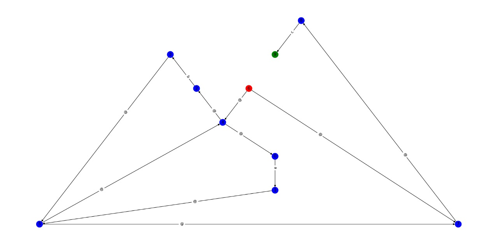
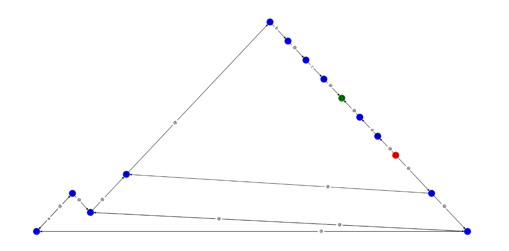
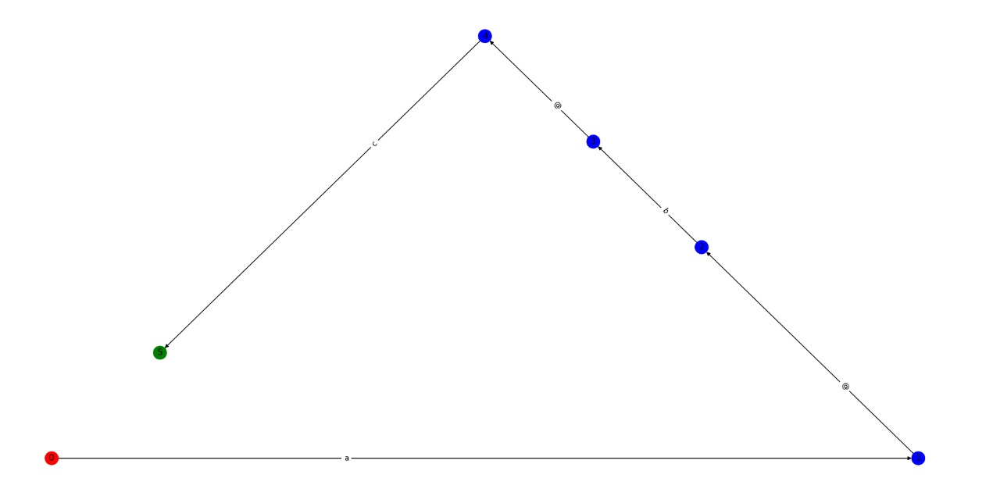
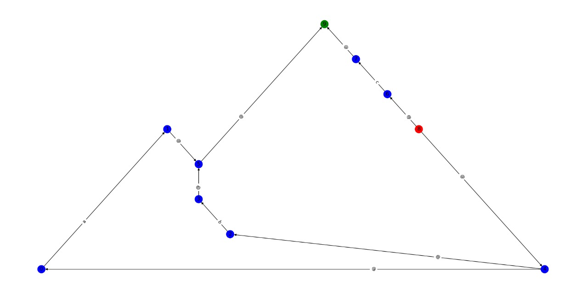
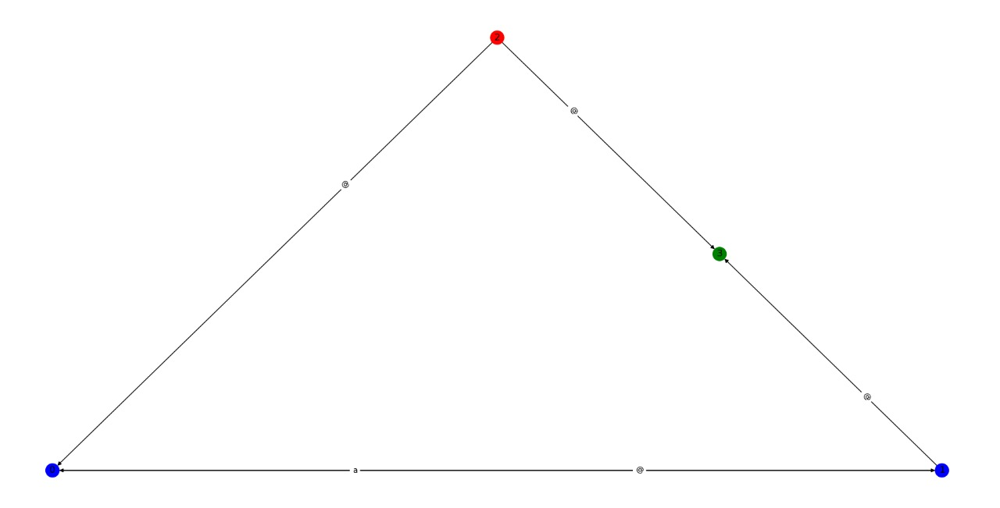

<h1 align = "center"> Regex to Non-Deterministic Finite Automata </h1>
I have developed a Regular Expression to epsilon-Non-Deterministic Finite Automata Convertor program in C++ and visualized the corresponding NFA using python visualization library (<em>networkx</em>).

<h2 id="usage"> 📋 Usage Instructions </h2>

1. Clone this repository using
`git clone https://github.com/harshsingh-24/sturdy-compiler-design.git` or downloading the zip-file.
2. Change the `inputToConvertor.txt` file for customized Input. The first line of Input is the valid Alphabet Set seperated by spaces and second line of Input is the Regular Expression which is to be converted into NFA.
3. Execute the `runner_assignment.bat` file and the graph will be generated automatically
4. Note that red node is the start node and green node is the final node

<h2 id="usage"> 📋 Examples </h2>

### 1. Regular Expression - (a+b)*c

  
### 2. Regular Expression - a**bc+d

### 3. Regular Expression - abc

### 4. Regular Expression - a+b+c

### 5. Regular Expression - a*

<!-- CREDITS -->
<h2 id="credits"> :scroll: Credits</h2>

Harsh Singh Jadon 

