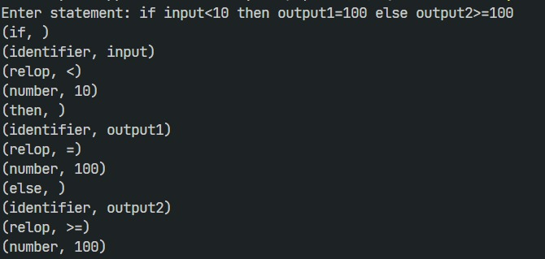
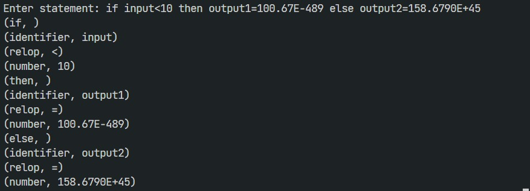
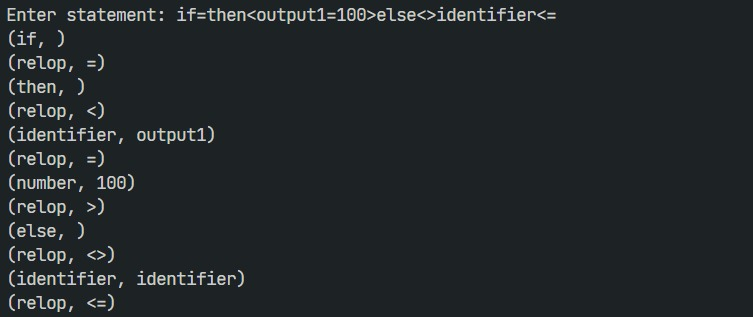

<h1 align = "center"> Lexical Analyser </h1>
Lexical Analyser is a process of converting a sequence of characters (such as in a computer program) into a sequence of lexical tokens (strings with an assigned and thus identified meaning). A program that performs lexical analysis may be termed a lexer or a tokenizer. A lexer forms the first phase of a compiler frontend in modern processing. Analysis generally occurs in one pass.


<h2 id="usage"> 📋 Usage Instructions </h2>

1. Clone this repository using
`git clone https://github.com/harshsingh-24/sturdy-compiler-design.git` or downloading the zip-file.
2. Compile the `lexicalAnalyser.cpp` file using `g++ lexicalAnalyser.cpp -o lexicalAnalyser` 
3. Run the executable generated using `./lexicalAnayser.exe`
4. Provide the input to the program. Currently, the Lexical Analyser generates tokens only for if, else, then, numbers, identifiers and whitespaces present in a sequence. 


<h2 id="usage"> 🎁 Context Free Grammar </h2>

``Language Support : `` The Context Free Grammar for which our Lexical Analyser is able to generate tokens is as follows - 

```
stmt -> if expr then stmt | if expr then stmt else stmt | epsilon

expr -> term relop term | term

term -> identifier | number
```


<h2 id="usage"> 💥 Pattern for Tokens </h2>

The patterns for the tokens in the above language are described below:

```
digit -> [0-9]
digits -> digit+
number -> digits  (. digits)?(E[+-]? digits)?
letter -> [A-Za-z]
identifier -> letter (letter | digit)*
if -> if
then -> then
else -> else
relop -> < | > | <= | >= | = | < >

```


<h2 id="usage"> 🔩 Implementation Details </h2>

If you think, that I am parsing and generating token from the input statement based on whitespaces present in string then you are totally wrong. The Lexical Analyser which I have made generates tokens without whitespaces as well. 

I am making use of Generalized Deterministic Finite Automata in order to identify the tokens present in input statement. In total, my program comprises of seven transition diagrams or DFAs, which help in identifying a particular token. These seven machines are associated with the detection of following token: 
<ul>
<li>Relational Operators</li>
<li>if Keyword</li>
<li>else Keyword</li>
<li>then Keyword</li>
<li>Identifiers</li>
<li>Numbers</li>
<li>Whitespaces</li>
</ul>

The input is fed serially to the above mentioned DFAs and the pointer to the character of statement is reseted/moved forward based on rejection/acceptance from DFA.


<h2 id="usage"> ✨ Examples </h2>

### 1. `if input<10 then output1=100 else output2>=100`

<p align = "center">

</p>
  
### 2. `if input<10 then output1=100.67E-489 else output2=158.6790E+45`

<p align = "center">

</p>

### 3. `No Spaces`

<p align = "center">

</p>


<!-- CREDITS -->
<h2 id="credits"> 🎇 Credits</h2>

Harsh Singh Jadon 

[](https://twitter.com/harshsjadon)
[](https://github.com/harshsingh-24)
[](https://www.linkedin.com/in/harsh-singh-jadon-55ab4519a/)
