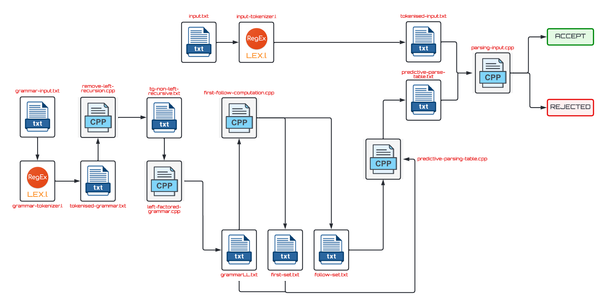

<h1 align = "center"> Compiler Frontend </h1>
A compiler can broadly be divided into two phases based on the way they compile. 

The front-end of the compiler or the analysis phase of the compiler reads the source program, divides it into core parts and then checks for lexical, grammar and syntax errors.The analysis phase generates an intermediate representation of the source program and symbol table, which should be fed to the backend as input.

This program when given a Context Free Grammar (G) and a string (s) in the language of grammar as input, prints the series of steps that needs to be followed from start symbol of the productions in G in order to achieve the target string s. It check whether the string s belongs to G to not by accepting or rejecting it. (Syntax Analysis)  


<h2 id="usage"> 📋 Usage Instructions </h2>

1. Clone this repository using
`git clone https://github.com/harshsingh-24/sturdy-compiler-design.git` or downloading the zip-file.
2. Input files are: `grammar-input.txt`, `input.txt`
3. Output file is: `output.txt`. 
4. Encode given Context Free Grammar into Tokens using grammar-tokenizer.l
5. Remove Left Recursion from given grammar using `remove-left-recursion.cpp`
6. Left Factor the given Grammar using `left-factored-grammar.cpp`. The output of this step is a LL(1) grammar.
7. Use the LL(1) grammar to find first and follow sets of non-terminals present in G using `first-follow-computation.cpp`
8. Generate a predictive parsing table based on first and follow sets using `predictive-parsing-table.cpp`
9. Check the syntax of tokenised Input using `parsing-input.cpp`.
10. Compile CPP files using `gcc filename.cpp -o filename`
11. Compile Lex Files using `lex filename` and `gcc lex.yy.c -o name`.
12. Run the executables using `./exeName`


<h2 id="usage"> 🎁 Context Free Grammar </h2>

``Language Support : `` The Context Free Grammar for which our Frontend is checking the syntax of given input is - 

```
P -> prog DL SL end
DL -> D DL | #
D -> TY VL ;
TY -> int | float
VL -> id VL | id
SL -> S SL | #
S -> ES | IS | WS | IOS
ES -> id := E;
IS -> if BE then SL end | if BE then SL else SL end
WS -> while BE do SL end
IOS -> print PE | scan id
PE -> E | str
BE -> BE or AE | AE
AE -> AE and NE | NE
NE -> not NE | {BE} | RE
RE -> E=E | E<E | E>E
E -> E+T | E-T | T
T -> T*F | T/F | F
F -> (E) | id | ic | fc
```


<h2 id="usage"> 💥 Architecture Diagram </h2>

<p align = "center">

</p>


<h2 id="usage"> ✨ Sample Input (Accepted) </h2>

1. 

```
prog 
    int alpha beta;
    float gamma;
    alpha := (4.2E18+304) * (alpha-beta/gamma);
    if alpha>beta or beta<gamma and not gamma=alpha then
        delta := chi;
        print "tau&123"
    else 
        scan lambda
    end 
    while count > 5.2 do 
        omega := omega+1;
    end 
end
```
2. 

```
prog
    int i;
    int j;
    int sum;
    int count;
    float num;
    int temp;
    
    sum:=0;
    count:=5;
    scan count      
    print sum
    
    if count=3 then 
        sum:=2;
    else
        if count < 4 then 
            sum:=2.3E-18;
            if j < i then
                num := 65.42E-90;
            else
                if j < sum then
                    num := 56.7834;
                    print "Harsh Singh@#"
                end

                scan temp
            end
        end
        while count>2.3 do 
            sum:=sum-1;
        end
    end
    
    while sum > 0 do
        count:=count+1;
        i := 1.2345;
        
        if count=3 then 
            sum:=2;
        end
    end
end
```


<!-- CREDITS -->
<h2 id="credits"> 🎇 Credits</h2>

Harsh Singh Jadon 

[](https://twitter.com/harshsjadon)
[](https://github.com/harshsingh-24)
[](https://www.linkedin.com/in/harsh-singh-jadon-55ab4519a/)
