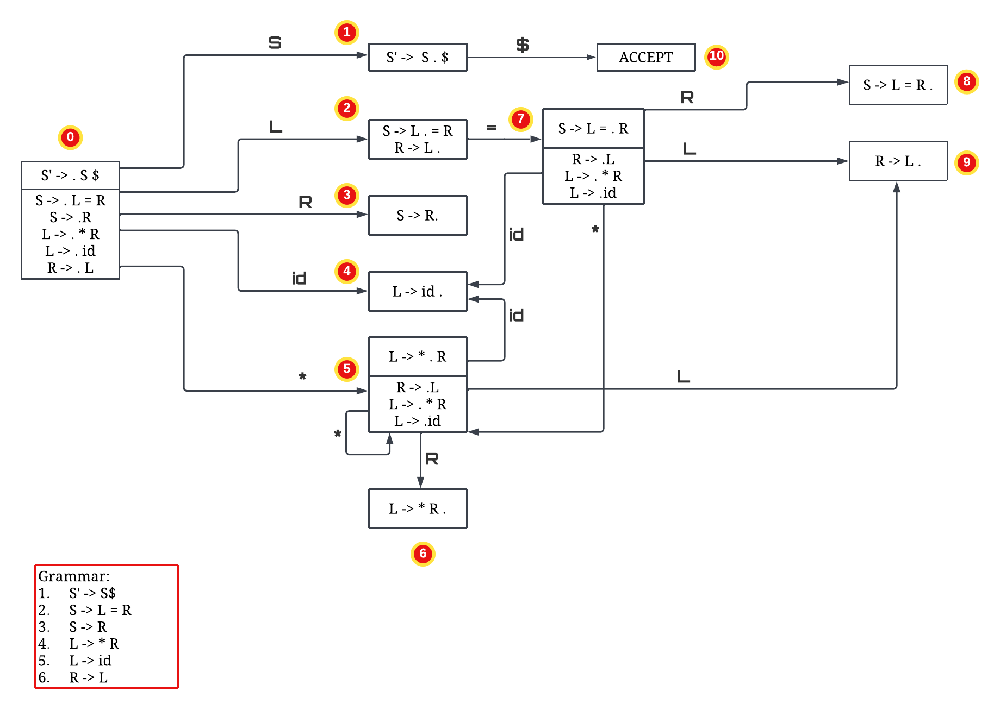
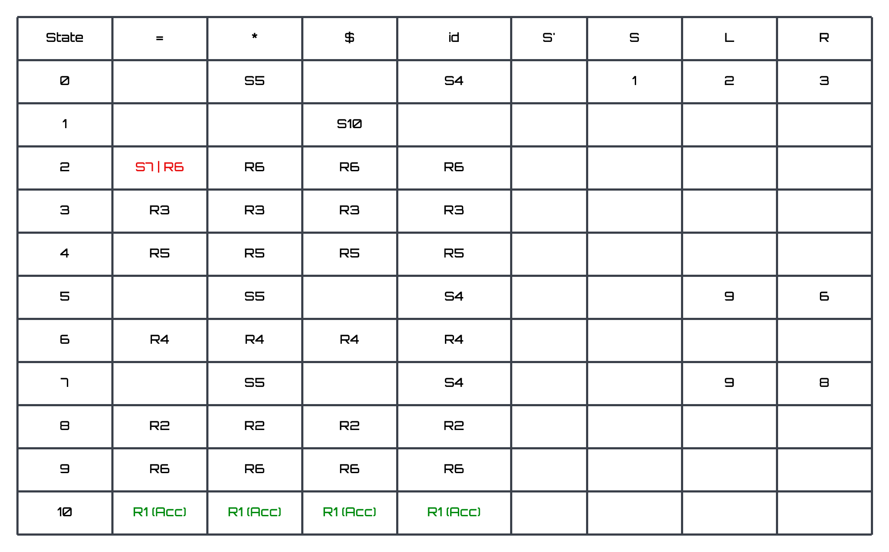

<h1 align = "center"> LR Parsing </h1>

Q1: 

We consider the following grammar for this assignment.
1. S’ -> S
2. S -> L=R | R
3. L -> *R | id
4. R -> L
Q1. Construct the LR DFA for the above grammar.
Clearly mention what are the items in each state.
Based on the LR() DFA, provide the LR() parse table for the grammar.
Briefly describe the process followed to build the automaton and the parse table.
Is the grammar LR?

<h2 id="usage"> 📋 Deterministic Finite Automaton </h2>

<h2 id="usage"> 🎁 Parse Table </h2>

<h2 id="usage"> 💥 Procedure </h2>

The procedure to build the DFA is as follows:
1. Add the first production to start state with dot appended in the front.
2. Compute the closure for it and name it as state 0.
3. Generate new state by computing GOTO(I, X), which basically means, one by one try to move on step
rightward by considering the possible right transitions. Generate their closures too.
4. Repeat the abovre steps until no new states can be generated.

The procedure to build the parse table is as follows:

1. Build table consists of Action of state x terminal matrix. For each state in DFA having directed arrow
labelled with terminal, an entry with value 'S,NewState' is added to table in table[state][Terminal]
denoting on this state, consuming Terminal, we shift to newState.
2. For every nonTerminal, id of newState is stored in the entry corresponding to previous state denoting,
the machine from previous state on the given nonTerminal, machine moves to newState.]
3. The states containing '.' symbol in the last are marked as reduction states showing the rule number by
which they should be reduced.

Conclusion: The grammar is not LR(0) as it has two entries in cell corresponding to state = '2' and symbol = '='. 

<!-- CREDITS -->
<h2 id="credits"> 🎇 Credits</h2>

Harsh Singh Jadon 

