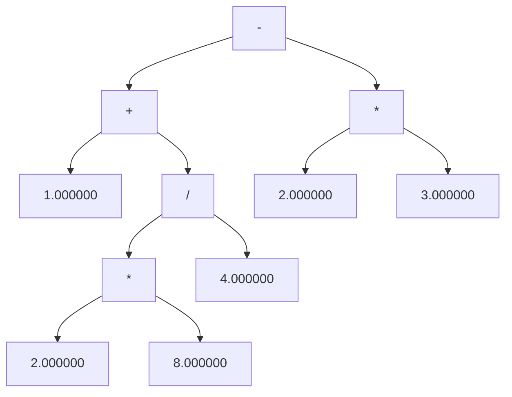
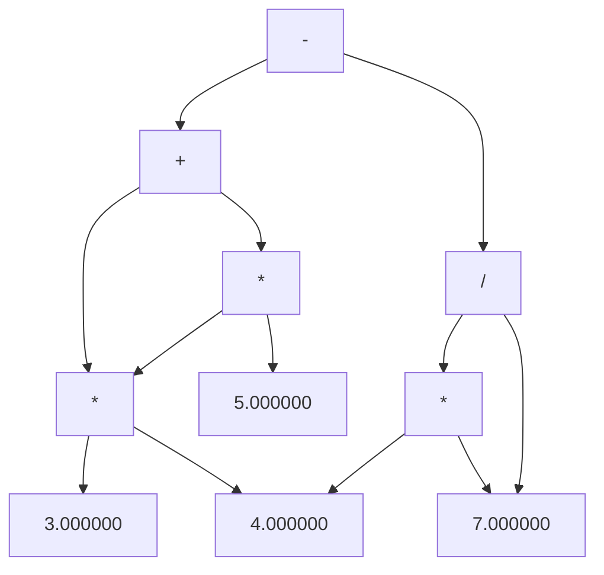

<h1 align = "center"> Compiler Intermediate Representation </h1>
A compiler can broadly be divided into two phases based on the way they compile. 

The front-end of the compiler or the analysis phase of the compiler reads the source program, divides it into core parts and then checks for lexical, grammar and syntax errors. The analysis phase generates an intermediate code representation of the source program and symbol table, which should be fed to the backend as input.

In the analysis-synthesis model of a compiler, the front end of a compiler translates a source program into an independent intermediate code, then the back end of the compiler uses this intermediate code to generate the target code (which can be understood by the machine). Intermediate Representation can translate the source program into the machine program. Intermediate code is generated because the compiler can’t generate machine code directly in one pass. Therefore, first, it converts the source program into intermediate code, which performs efficient generation of machine code further. The intermediate code can be represented in the form of 3-address code, Abstract Syntax Trees and Directed Acyclic Graph.


<h2 id="usage"> 📋 Usage Instructions </h2>

Note: Every folder comprises of seperate .y and .l files for respective tasks. 

1. Clone this repository using
`git clone https://github.com/harshsingh-24/sturdy-compiler-design.git` or downloading the zip-file.
2. Input files: `input.txt`
3. Compile the `parse.y` program using `yacc parse.y -d'. The result of the compilation are these two files - `parse.tab.h` and `parse.tab.c`.
4. Compile the `lex.l` program using `lex tokenizer.l`.
5. Compile `parse.tab.c` using `g++ parse.tab.c -o parser`
6. Execute the parser using `./parser.exe`

Note: We will consider grammar for a simple calculator supporting operations like addition, subtraction, multiplication and division for the above mentioned Intermediate Code Generators.


<h2 id="usage"> 🌴 Abstract Syntax Tree </h2>

``Language Support:``  The attribute grammar to generate the AST, using the semantic actions, is given as -  

```
S -> E (inorderTraversal(E.node))

E -> E1 + T  (E.node = new Node('+', E1.node, T.node, E1.val + T.val))
E -> E1 - T  (E.node = new Node('-', E1.node, T.node, E1.val - T.val))
E -> T (E.node = T.node)

T -> T1 * F (T.node = new Node('*', T1.node, F.node, T1.val * F.val))
T -> T1 / F (T.node = new Node('/', T1.node, F.node, T1.val / F.val))  
T -> F (T.node = F.node)

F -> FLOATCONST (F.node = new Node(FLOATCONST.floatValue))
```

``Structure of node:``

```
class Node{
public:
Node *left = NULL, *right = NULL;
double val = 0;
char type;
};
```

``Explantion:`` For every float constant encountered, we make a leaf node. We pass that node to the non-terminal parent. For every symbol expression like E+T, we make a node with + as parent and nodes from E and T as left and right children. An abstract syntax tree (AST) is very similar to parse tree where extraneous nodes are removed (nodes for most non-terminal symbols removed). We recursively make the tree up the parse tree.

***Sample Input***

```
1 + 2 * 8 / 4 - 2 * 3
```

***Sample Output(Terminal)***
```
Evaluation Result: -1
Entered arithmetic expression is Valid.
```

***Sample Output(AST Graph)***




<h2 id="usage"> 🍁 Directed Acyclic Graph </h2>

``Language Support:``  The attribute grammar to generate the DAG, using the semantic actions, is given as -  

```
S -> E (inorderTraversal(E.node))

E -> E1 + T  {
    Node* node = searchNodeInSymbolTable("+", E1.node, T.node);
    if(node == NULL) {
        string sa = to_string((long long)E1.node);
        string sb = to_string((long long)T.node);

        string s = "+" + sa + sb;
        Node* temp = new Node(1, E1.node, T.node, E1.val + T.val, s);
        E.node = temp;
        SymbolTable[s] = temp;
    } else {
        E.node = node;
    }
}  ----> SA_1
E -> E1 - T  {Same as SA_1 with operator changed}
E -> T (E.node = T.node)

T -> T1 * F {Same as SA_1 with operator changed}
T -> T1 / F {Same as SA_1 with operator changed}
T -> F (T.node = F.node)

F-> FLOATCONST 
{
    string constant = to_string(FLOATCONST.val);
    if(m.find(constant) != m.end()) {
        F.node = m[constant];
    } 
    else {
        Node* temp = new Node(constant, $<value>1);
        SymbolTable[constant] = temp;
        F.node = temp;
    }
}
```

``Structure of node:``

```
class Node{
public:
Node *left = NULL, *right = NULL;
double val = 0;
char type;
string uniqueID;
};
```

***Sample Input***

```
3 * 4 + 3 * 4 * 5 - 4 * 7 / 7
```

***Sample Output(Terminal)***
```
Formed String Key: *1691634416916480
Formed String Key: *1691634416916480
Formed String Key: *1691497616915096
Formed String Key: +1691497616915248
Formed String Key: *1691648016915624
Formed String Key: /1691577616915624
Formed String Key: -1691546416915968
Evaluation Result: 68

Entered arithmetic expression is Valid.
```

***Sample Output(AST Graph)***




<h2 id="usage"> 3️⃣🏠 3-address code </h2>

``Language Support:``  The attribute grammar to generate the 3-address code, using the semantic actions, is given as -  

```
E1 -> E2 + T {
string id = genSymbol();
E1.symbol = id;
output += id + " = " + E2.symbol + " + " + T.symbol + "\n";
}
E1 -> E2 - T {
string id = genSymbol();
E1.symbol = id;
output += id + " = " + E2.symbol + " - " + T.symbol + "\n";
}
E -> T {
E.symbol = T.symbol;
}
T1 -> T2 * F {
string id = genSymbol();
T1.symbol = id;
output += id + " = " + T2.symbol + " * " + F.symbol + "\n";
}
T1 -> T2 / F {
string id = genSymbol();
T1.symbol = id;
output += id + " = " + T2.symbol + " / " + F.symbol + "\n";
}
T -> F {
T.node = F.node
}
F -> number {
F.symbol = to_string(number);
}
```

``Explantion:`` Every node is assigned a symbol. For a number, the symbol is basically its
value in string format. Whenever branching (due to operators) is seen, a new symbol is created and new symbol is made equal to the result of the operation (added to the output code) and new symbol is returned as id for the parent. Basically, every operation returns a symbol which is equal to the result of the operation.

***Sample Input***

```
1 + 2 - 3 * 4 / 5 * 3 + 6
```

***Sample Output***

```
t0 = 1.000000 + 2.000000
t1 = 3.000000 * 4.000000
t2 = t1 / 5.000000
t3 = t2 * 3.000000
t4 = t0 - t3
t5 = t4 + 6.000000
Evaluation Result: 1.8
```


<h2 id="usage"> ➕ GCC Intermediate Codes </h2>

``Sample Code``

```
#include <stdio.h>
int main() {
    int harsh = 1;
    for(int i=0; i<10; i++) {
        harsh = harsh + 1;
    }
    printf("%d", harsh);
}
```

1. Abstract Syntax Tree:
`gcc test.c -fdump-tree-original-raw`

Output: 

```
;; Function getc (null)
;; enabled by -tree-original

@1      bind_expr        type: @2       body: @3      
@2      void_type        name: @4       algn: 8       
@3      return_expr      type: @2       expr: @5      
@4      type_decl        name: @6       type: @2      
@5      modify_expr      type: @7       op 0: @8       op 1: @9      
@6      identifier_node  strg: void     lngt: 4       
@7      integer_type     name: @10      size: @11      algn: 32      
                         prec: 32       sign: signed   min : @12     
                         max : @13     
@8      result_decl      type: @7       scpe: @14      srcp: stdio.h:693    
                         note: artificial              size: @11     
                         algn: 32      
@9      cond_expr        type: @7       op 0: @15      op 1: @16     
                         op 2: @17     
@10     type_decl        name: @18      type: @7      
@11     integer_cst      type: @19     int: 32
@12     integer_cst      type: @7      int: -2147483648
@13     integer_cst      type: @7      int: 2147483647
@14     function_decl    name: @20      type: @21      srcp: stdio.h:693    
                         args: @22      body: undefined 
```

Note: Full Output available at `gcc-intermediate-code/sample.c.003t.original`.

2. Gnu SIMPLE representation (GIMPLE):
`gcc test.c -fdump-tree-gimple-raw`

Output:

```
main ()
gimple_bind <
  int D.1888;

  gimple_bind <
    int harsh;

    gimple_assign <integer_cst, harsh, 1, NULL, NULL>
    gimple_bind <
      int i;

      gimple_assign <integer_cst, i, 0, NULL, NULL>
      gimple_goto <<D.1885>>
      gimple_label <<D.1884>>
      gimple_assign <plus_expr, harsh, harsh, 1, NULL>
      gimple_assign <plus_expr, i, i, 1, NULL>
      gimple_label <<D.1885>>
      gimple_cond <le_expr, i, 9, <D.1884>, <D.1886>>
      gimple_label <<D.1886>>
    >
    gimple_call <printf, NULL, "%d", harsh>
  >
  gimple_assign <integer_cst, D.1888, 0, NULL, NULL>
  gimple_return <D.1888 NULL>
>
```

Note: Full Output available at `gcc-intermediate-code/sample.c.004t.gimple`.

3. Control Flow Graph (CFG):
`gcc test.c -fdump-tree-cfg-raw`
Output:

```
main ()
{
  int i;
  int harsh;
  int D.1888;

  <bb 2>:
  gimple_assign <integer_cst, harsh, 1, NULL, NULL>
  gimple_assign <integer_cst, i, 0, NULL, NULL>
  goto <bb 4>;

  <bb 3>:
  gimple_assign <plus_expr, harsh, harsh, 1, NULL>
  gimple_assign <plus_expr, i, i, 1, NULL>

  <bb 4>:
  gimple_cond <le_expr, i, 9, NULL, NULL>
    goto <bb 3>;
  else
    goto <bb 5>;

  <bb 5>:
  gimple_call <printf, NULL, "%d", harsh>
  gimple_assign <integer_cst, D.1888, 0, NULL, NULL>

gimple_label <<L3>>
  gimple_return <D.1888 NULL>

}
```

Note: Full Output available at `gcc-intermediate-code/sample.c.011t.cfg`.

4. Register Transfer Language:(RTL)
`gcc sample.c -da`

Output:
It generates lots of files which can be found in: `gcc-intermediate-code/rtl` All except the above files are generated by this.


<!-- CREDITS -->
<h2 id="credits"> 🎇 Credits</h2>

Harsh Singh Jadon 

[](https://twitter.com/harshsjadon)
[](https://github.com/harshsingh-24)
[](https://www.linkedin.com/in/harsh-singh-jadon-55ab4519a/)
